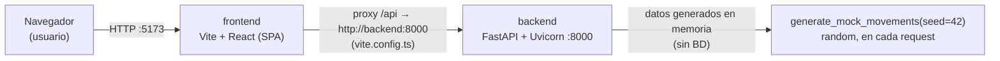

# Arquitectura general

## Vista general

✅ **Verificada** — Arquitectura de dos servicios independientes orquestados por Docker Compose, sin base de datos ni servicios adicionales: [docker-compose.yml](../docker-compose.yml) define únicamente `frontend` y `backend`.

## Backend

✅ **Verificada** — Módulo único `backend/app/`, sin capas separadas (no hay `services/`, `repositories/`, `models/` como carpetas): [backend/app/main.py](../backend/app/main.py) (bootstrap FastAPI + CORS) y [backend/app/routes.py](../backend/app/routes.py) (modelos Pydantic + lógica + endpoints, todo en un archivo).
✅ **Verificada** — CORS abierto a cualquier origen: `backend/app/main.py` `allow_origins=["*"], allow_credentials=True, allow_methods=["*"], allow_headers=["*"]`.
✅ **Verificada** — No hay persistencia: cada endpoint vuelve a generar los datos llamando `generate_mock_movements(seed=42)` (mismo seed en cada llamada, dentro de cada función de `routes.py`), no se leen de archivo ni base de datos.

## Frontend

✅ **Verificada** — SPA servida por Vite, sin SSR: `components.json` declara `"rsc": false`; `vite.config.ts` no configura SSR.
✅ **Verificada** — Comunicación con el backend vía proxy de desarrollo `/api` → `http://backend:8000` (nombre de servicio Docker Compose), definido en [frontend/vite.config.ts](../frontend/vite.config.ts).
✅ **Verificada** — Estructura interna: `components/dashboard/` (componentes de negocio: `dashboard-header.tsx`, `kpi-card.tsx`, `kpi-row.tsx`, `income-outcome-chart.tsx`, `profit-percent-chart.tsx`) vs `components/ui/` (primitivos shadcn: `card.tsx`, `skeleton.tsx`, `button.tsx`) vs `lib/` (tipos y utilidades: `financial-types.ts`, `financial-utils.ts`, `mock-data.ts`, `utils.ts`).
❓ **Parcialmente verificada** — Existe [frontend/src/lib/mock-data.ts](../frontend/src/lib/mock-data.ts), lo que sugiere que el frontend también puede tener datos simulados propios además de los del backend, pero no inspeccioné su contenido ni confirmé si se usa actualmente en algún componente.

## Comunicación entre servicios

✅ **Verificada** — En Docker Compose, `frontend` declara `depends_on: [backend]`, por lo que Compose arranca `backend` antes que `frontend` (no garantiza que el backend esté "listo", solo que el contenedor inició): [docker-compose.yml](../docker-compose.yml).
